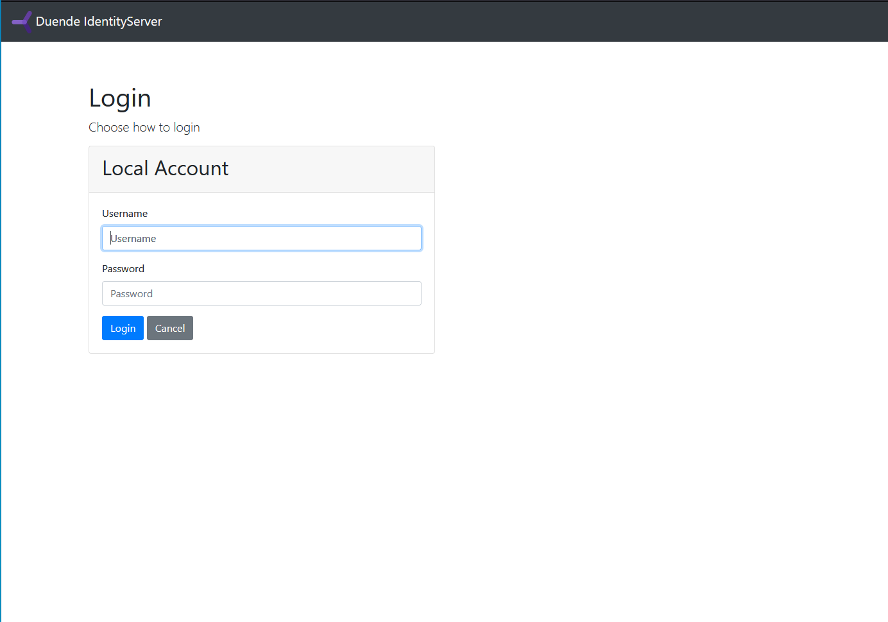

# Sandbox to test Camunda without Keycloak
## Current state
- Zeebe api calls are working. See step 
- Identity and operate login mask visible. See step 
- For both identity and operate it seems that the access rights are not yet configured correctly

## Prerequisite
Add the following entries in the hosts file (Windows: C:\Windows\System32\Drivers\etc\hosts; Linux, MacOS: /etc/hosts)
```
# Camunda Sandbox
127.0.0.1 csb-idp.docker
127.0.0.1 csb-identity.docker
127.0.0.1 csb-operate.docker
```

## Steps to test
1. Start docker compose with

    `docker compose up -d`
1. Execute the follwoing command (be sure that the file netshoot/topology.sh is stored with LF endings only)

    `docker exec -it csb-netshoot /tmp/netshoot/topology.sh`

    The script creates an access token and calls the Topology gRPC method of Zeebe first without bearer token and then with the bearer token

1. Open url http://csb-identity.docker:5010/
    - If you do not see a login page similar to [](DuendeLoginPage.png) try with a new private browser window.
    - Enter the login credentials. Username: Identity, Password: pwd
    - **FAIL**: you do not have sufficient permissions to view this page

1. Execute the following command (be sure that the file netshoot/simulate-ui-login.sh is stored with LF endings only) to get the tokens related to the Identity login

    `docker exec -it csb-netshoot /tmp/netshoot/simulate-ui-login.sh identity`

    - You should see the token json.
    - Copy paste the access_token and use https://jwt.io to check the content of it

1. Open url http://csb-operate.docker:5010/
    - Enter the login credentials. Username: Operate, Password: pwd
    - **FAIL**: No permission for Operate - Please check your operate configuration or cloud configuration.

1. Execute the following command (be sure that the file netshoot/simulate-ui-login.sh is stored with LF endings only) to get the tokens related to the Operate login

    `docker exec -it csb-netshoot /tmp/netshoot/simulate-ui-login.sh operate`

    - You should see the token json.
    - Copy paste the access_token and use https://jwt.io to check the content of it

1. Shutdown with

    `docker compose down`
